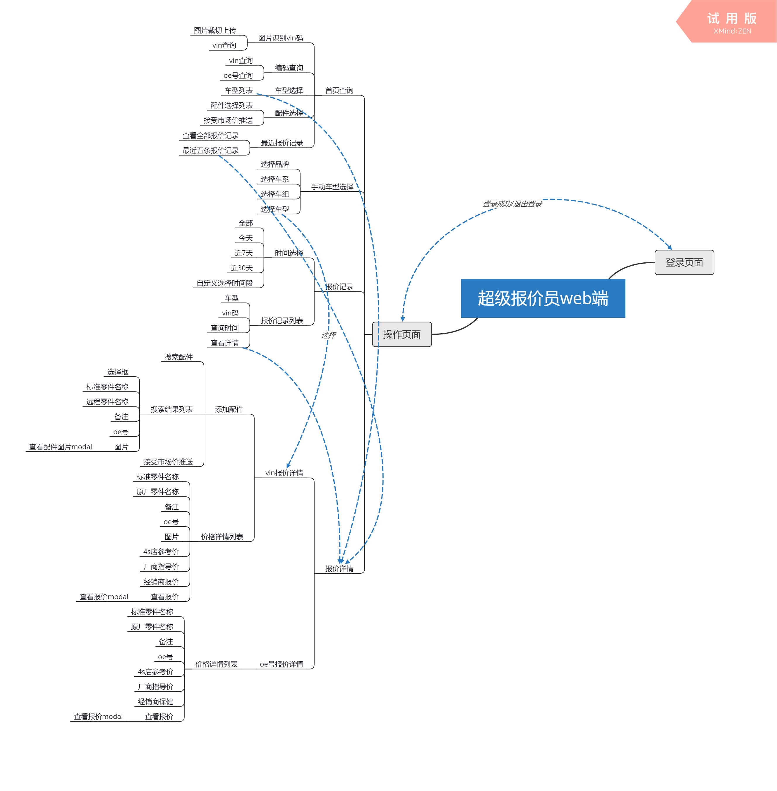

# 新版开发框架结构---以超级报价员 web 为例

[TOC]

## 目录结构

```
卷 新加卷 的文件夹 PATH 列表
卷序列号为 4A67-8AE7
D:.
├─.vscode   # vscode配置
├─config    # webpack配置
├─dist      # 构建生成的文件
│  └─static # 静态资源
│      ├─images
│      └─js
├─mock      # mock 配置
└─src       # 开发目录
    ├─assets    # 静态资源
    │  ├─images
    │  ├─less
    │  │  ├─base
    │  │  ├─effects
    │  │  │  ├─2d-transitions
    │  │  │  ├─background-transitions
    │  │  │  ├─border-transitions
    │  │  │  ├─curls
    │  │  │  ├─icons
    │  │  │  ├─shadow-and-glow-transitions
    │  │  │  └─speech-bubbles
    │  │  └─pages
    │  └─svgs
    ├─components    # 组件目录
    │  ├─Header
    │  ├─Icon
    │  ├─Input
    │  ├─Load
    │  ├─SiderBar
    │  ├─Style
    │  └─WeChat
    ├─constants     # 常量目录
    ├─container     # 逻辑页面目录
    │  ├─home       # 首页
    │  ├─price      # 价格详情
    │  ├─record     # 历史记录
    │  └─selectCar  # 选择车型
    ├─layouts       # 基本布局模板页
    ├─models        # 存放通用业务的过程函数
    ├─pages         # 静态页面
    ├─redux         # redux
    │  ├─action
    │  ├─reducer
    │  └─store
    ├─services      # 服务请求
    └─utils         # 工具函数
```

**目录命名说明：**只以 react 组件作为子文件的目录，且没有更深层级的目录在命名上使用的为大驼峰命名，其他情况使用小驼峰命名法。现在 container 目录下的文件没有使用大驼峰的原因是，里面后期可能会包含 redux，index.jsx 统一导出，供其他部分调用。
**文件命名说明：**一般 react 组件使用大驼峰命名，但 index.jsx 除外，这样是为了引入组件时只需要定位到该目录下，就能自动调用 index.jsx 文件。

## 功能点


